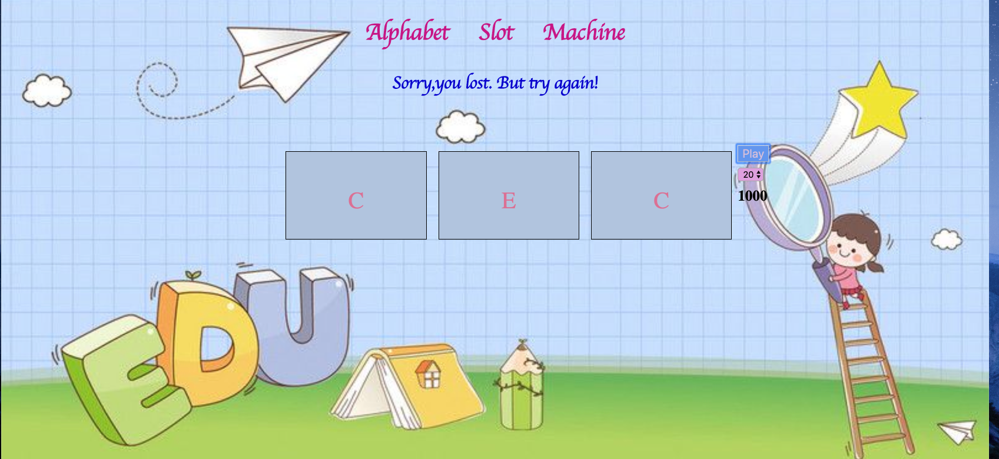

# Slot Machine

It's a  simple slot machine with minimum 5 items per reel and 3 reels - user should be able to bet min or max and have their total update

View project [Here](slotmachinebyaiperi.netlify.com)

## How It's Made:

**Tech Used**: HTML5,CSS3,JavaScript

## Lessons Learned:

* How to do pseudo-coding before building it.
* How to use randomize item by Math.floor
