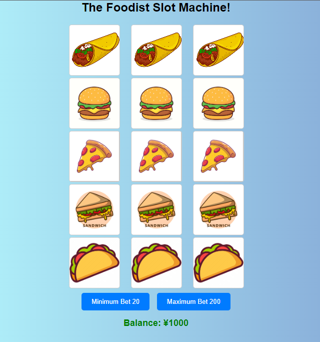

# 🎰 Project: Slot Machine

### Goal: Build a Simple Slot Machine

This project is a slot machine with 3 reels & 5 rolls i used a math random function to randomly generate the odds to wins.
I also used a function to stop the user from proceding to spam the roll function, i allowed users to bet the smallest amount & max amount. 

### How it's Made
Tech used: HTML, CSS, Javascript

I took inspiration from the a japanese style casino & made it food themed.

### Optimizations

### Lessons Learned
I learned alot about formula's for creating a random chance to win & lose.
The slot machine also taught me alot to breakthings down step by step even breaking a single step into multiple steps.
Psuedo-coding each step was extremly helpful in visualizing what everything does.

## Example

