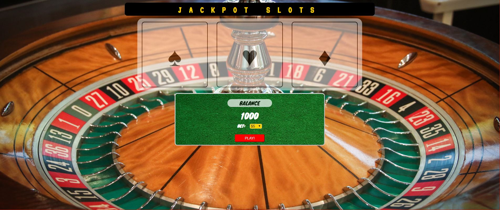

# 🎰 Slots

 Built a three slot machine.

**Link to project:** TBA

## How It's Made:

 **Languages used:**  HTML, CSS, JavaScript

Each slot contains the same five possible outcome. I use just one function to randomized those outcomes and compare those outcomes to each  other and determine if the player win 10x more of their bet(when three randomly chosen slots items are matching) or lose their bet (when three randomly chosen slots items are **NOT** matching)

## Optimizations
  - Make the slots white (CSS)
  - ADD condtional statement for when balance reach 0, it will end the game.
  - IMPROVE syntax consistently
  
## Other Works:

  **TO-DO List:** https://github.com/zjacobsdev/todo-list-2019-week05/tree/answer
