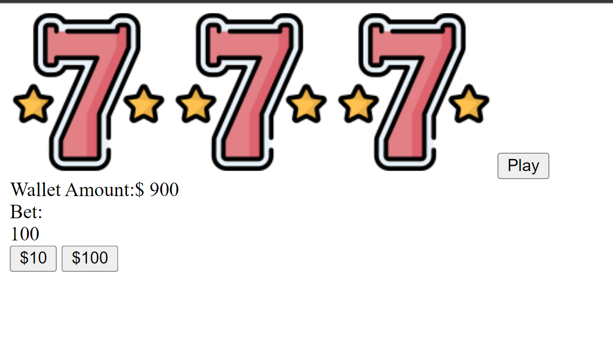

# 🎰 Week05 Bootcamp2019 Project: Slot Machine

The goal of this project was to make a slot machine with minimum 5 items per reel and 3 reels and allow the user to be able to bet min or max and have their total update

This project involved using Javascript to manipluate the dom and make the website interactive.

My next goal for this project is to add css 

link to Slot Machine
https://burhan-ali-slotmachine.netlify.app/

