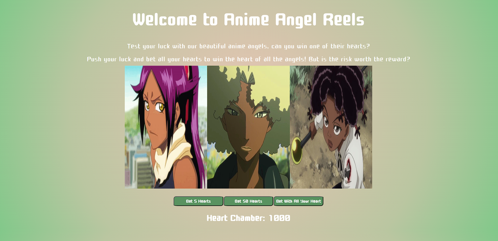

# 🎰 RC 2023B Project: Slot Machine

### Goal: Build a Simple Slot Machine

Build a simple slot machine with minimum 5 items per reel and 3 reels - user should be able to bet min or max and have their total update

Link to project: (https://animeangelsreels.netlify.app/)

### How I Made It:

Tech used: HTML, CSS, JavaScript

I used HTML to create the base of the slot machine. I use three divs to create the containers for the slots and the images. Then I created three buttons for the min bet, max bet, and the all in bet. I created a container to hold the players' starting amount and a container to notify the player if they won or lost. 

Then I used JavaScript to build the logic of the slot machine. I created the variable moneyPot to hold the money that the player starts out with and add to the DOM inside the html of the container I created in html. I made it so when the player clicks on each button it used an eventListener to run their respective functions. I created a randomizer funcation along with an array that contained all the images that I want to randomize. For each function for the bets, I used if statements to subtract the bet from the moneyPot and update the container in html, then run the randomizer. I used another If statement to check if the randomized images matched each other and if they they it would add the winning to the pot and give a win notification, else player receives a losing notification. For the all in function I made so that the player bets the remaining pot that they have left for a chance to hit the jackpot. If player wins this bet, they receive double the amount they bet but if they lose they go bankrupt(heartbrokem)

### Optimizations:

In the beginning of this project, I called the randomizer function inside the betting functions but outside of the if statements so the images would continue to randomize. I wanted to stop this so I updated the functions to only run the randomizer function inside the if statement of each betting function. I also wanted to stop the bet function from allowing the user to going into the negative after they reach zero. I updated the if statement so that if the pot less than or equal to the bet amount to not run anything and tell the player they dont have enough funds. Else, if the pot amount is more than the bet amount then run the randomizer function and allow the player to make the bet. 

### Lessons Learned: 

I definitely learned a few lessons from this one. 

Figuring out how to cycle throught the array randomly took me a while to understand how to do. I definitely think my code could of been drier for this part but it was easier for me to elongate it in order to understand my actions better. 

I learned the differenced between InnerText and InnerHTML. I thought they were basically the same and I think that's why my images origially werent appearing.

I would like try and implement this without using an array.