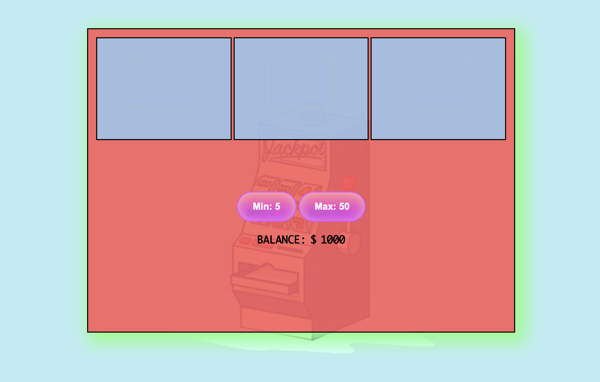

# 🎰 Week05 Bootcamp2019 Project: Slot Machine

### Goal: Build a Simple Slot Machine

<h1>My Simple Slot Machine</h1>

Build a simple slot machine with minimum 5 items per reel and 3 reels - user should be able to bet min or max and have their total update

<strong>Link To Project: </strong>https://condescending-goodall-fdcd9e.netlify.app/

<strong>How It's Made</strong>

<i>Tech Used: </i>HTML, CSS, JavaScript

I started by creating the outline of what I wanted my project to consist of, basic HTML and CSS for box outlines and buttons.
I saved the necessary images into my Images folders and assigned them in an array to call them within my JavaScript.
My JS pushes win or lose text to the DOM depending on the condition (whether the three pictures match or not).
I used the Math.Random function to be sure that the rotation of the images in the array were randomly selected.
The min-max bid-buttons withdraw the respective amounts from your balance and the gamble begins.
If won, your bid is increased *10 and a winning message is displayed. Otherwise a losing message is displayed and you don't gain any more balance.

<strong>Lessons Learned:</strong>
 
 This was a bit more of an "advanced" project for someone just starting out in JavaScript, from figuring out how to make
 a randomizer for the pictures in the slot machine, to making sure the buttons subtracted the proper amount and showed that 
 result on the DOM. But I continue to learn the various ways you can make things work in a programming language such as JS. I saw ways
 to use multiple functions to make the project work, but also methods that used less functions and instead incorporated more If-Else conditionals. 
 But they were still all similar and presented the same result. I'm still learning with practice and more experience in order to make
 my coding more effecient, but this project was a beginning stepping stone.
