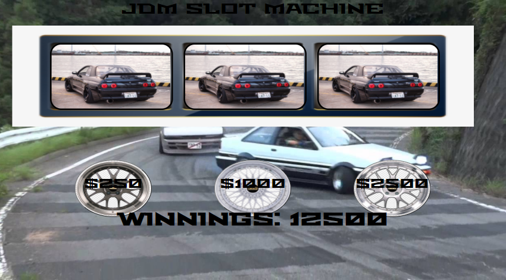

Project: JDM Slot Machine 

Goals: The goals of this project contitst of creating a systemt to randomly generate a car from 5 potential cars for 3 slots. When the 3 slots line up with the same car then you win that bet! You will win 10x the amount you bet. If you lose you will lose the amount of money you spent. Each game you start with $10,000. 

