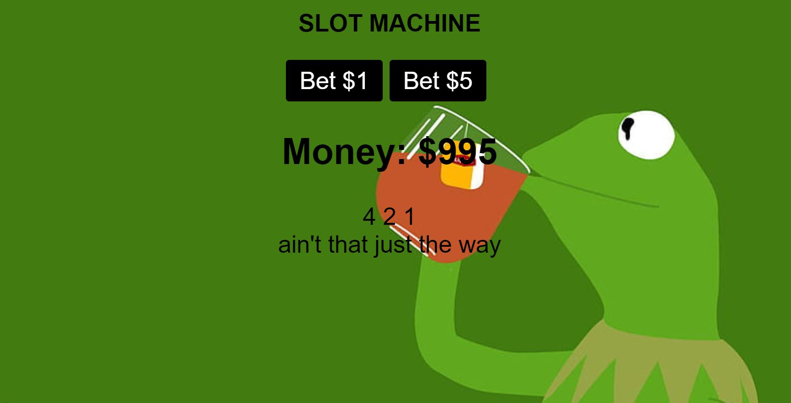

# Slot Machine
A simple slot machine with 5 numbers per reel and 3 reels. Users are able to bet min ($1) or max ($5) and have their total update accordingly.

Link to project: https://menahassan-slot-machine.netlify.app/

# How It's Made:
Tech used: HTML, CSS, JavaScript

# Lessons Learned
I was able to use Math.ceil() for the first time here. I combinded it with the Math.random() method to generate a different random number between 1-5 for each reel of the slot machine.

