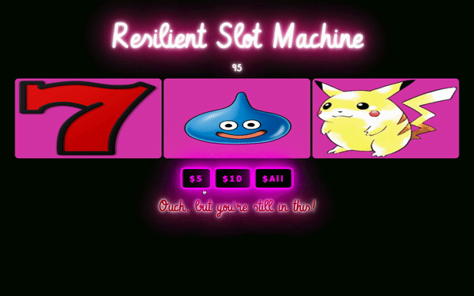

# Resilient Slot Machine
Todo List allows the user to log their 'todos' and mark off todos for clearing upon completetion. Enjoy a nice 

**Link to project:** https://cydvilla.github.io/todo-list/

## How It's Made:

**Tech used:** HTML, CSS, JavaScript

Utilziing JavaScript, Slot Machine employs the use of four different functions to place a 'min' bet of $5, a 'max' bet of $10, a truly remarkable 'All' bet of the player's current money and a function using Math.random() & Math.floor() methods to get reel images at random! Go on and test your luck!

<!-- ## Optimizations
*(optional)*

You don't have to include this section but interviewers *love* that you can not only deliver a final product that looks great but also functions efficiently. Did you write something then refactor it later and the result was 5x faster than the original implementation? Did you cache your assets? Things that you write in this section are **GREAT** to bring up in interviews and you can use this section as reference when studying for technical interviews! -->

## Lessons Learned:

Going overboard with CSS animations CAN and WILL cause extreme slowdown to your computer. 
