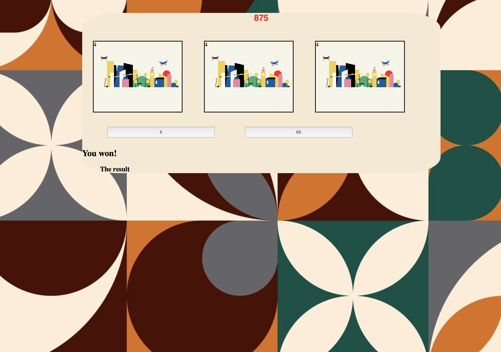

# 🎰 Week05 Bootcamp2019 Project: Slot Machine

### Goal: Build a Simple Slot Machine

This is my simple slot machine project! Players can place a minimum bet of $5 or a maximum bet of $50. In addition, players can also bet all in with their money with "life bet". I have also given the option to reduce your bet amount! 

</img>

Link to live site: [https://danielmtran-slotmachine.netlify.app]

### How It's Made:

Tech used: HTML, CSS, JAVASCRIPT

I made the basic styling and layout of the app via HTML and CSS. The main functionality of the app was made using Javascript.

### Optimizations:

I added additional styling to the fonts and images.

### Lessons Learned:

I would like to come back to this project and utilize arrays more in my Javascript.