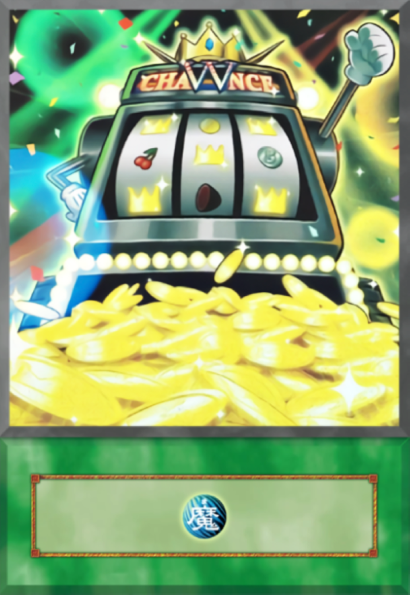

# Project: Slot Machine
A simple slot machine with 3 reels, 5 items per reel, a bank, and two bet options.

**View project in browser:** https://endev-slot.netlify.com

## Design and Development:
**Skills Used** HTML, CSS, JavaScript:
I built this slot machine by breaking down its various components and pseudo-coding what they would do. i.e; the reels display 5 randomized options, the bank is a formula that is ("balance" - "bet") for losses or ("balance" + "bet" x 10) for wins. Doing so made it easier to translate into functions in JavaScript.

## Lessons Learned
Biggest lesson was that DRY code will come with time and practice. In the beginning I started writing in JS by how I knew and after laying down the bulk of the foundation, I was able to optimize to achieve cleaner code. 
